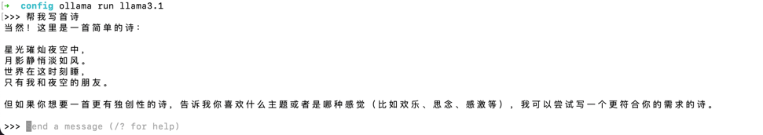

# LangChain4j-SpringBoot-Examples

当前项目主要用于LangChain4j的SpringBoot集成示例。  
主要包含各类LangChain4j工具的使用场景, 以及具体怎么整合到SpringBoot中。  
项目整体的示例使用的是开源模型(llama3.1版本), 该模型遵循openai的接口规范所以没有办法使用openai的可以直接用llama的模型替换。  
如果需要替换成openai的模型, 直接替换对应的配置项即可。
```properties
langchain4j.open-ai.chat-model.api-key=${your-openai-api-key:test-key}
langchain4j.open-ai.chat-model.base-url=${your-openai-base-url:http://localhost:11434/v1}
langchain4j.open-ai.chat-model.model-name=${your-openai-model-name:llama3.1:latest}
```

## Mac OS 环境下使用Ollama进行部署llama3.1模型

1. 下载Ollama进行安装, 下载地址 [https://ollama.com/download](https://ollama.com/download)
2. 安装完成后, 打开 shell 安装 llama3.1 模型: 
    ```shell
    ollama pull llama3.1
    ```
3. 启动 llama 服务测试是否正常
    ```shell
    ollama run llama3.1
   ```
   
## 示例说明
```text
|-- RAG-example                                  # RAG文档知识库应用场景示例
|   |-- http                                     # 示例http接口
|   |-- RAG_READEME.md                           # RAG文档知识库应用场景示例说明
|-- (持续完善中...)
```
* [RAG文档知识库应用场景示例](RAG-example/RAG_README.md)
* 自然语言交互MySQL数据查询应用场景示例(持续完善中...)
* Tool(function calling) 内置工具调用应用场景示例(持续完善中...)
* 图像生成(持续完善中...)
* SseEmitter的流式输出效果(持续完善中...)
* 集成搜索引擎动态检索(持续完善中...)
* 音视频生成(持续完善中...)

